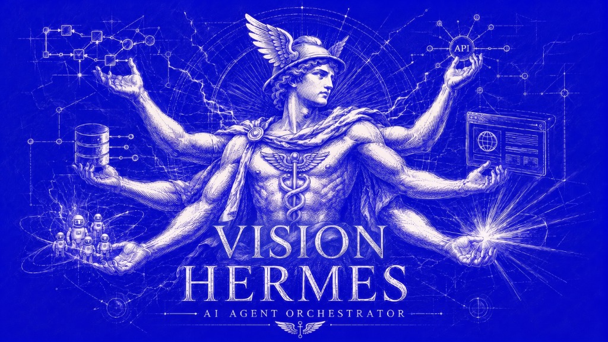
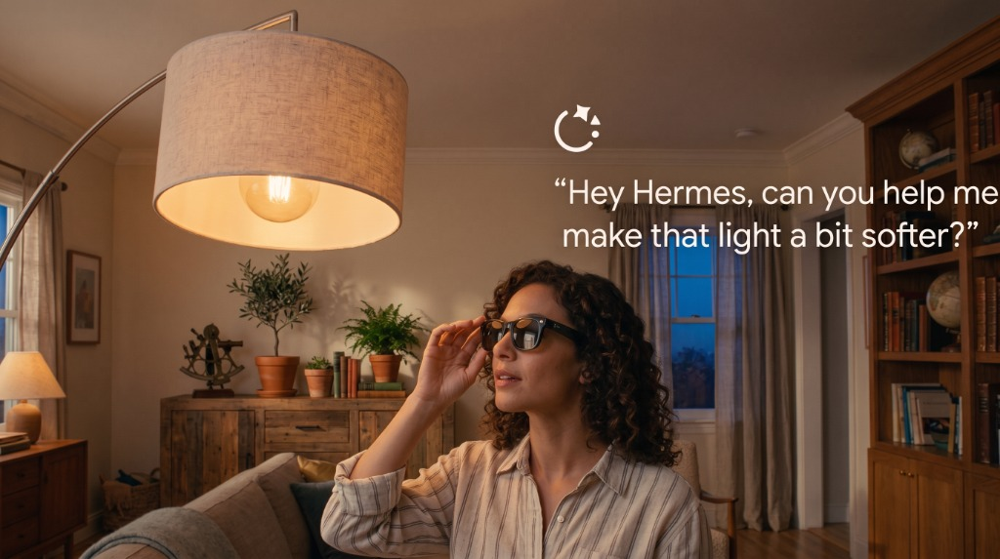
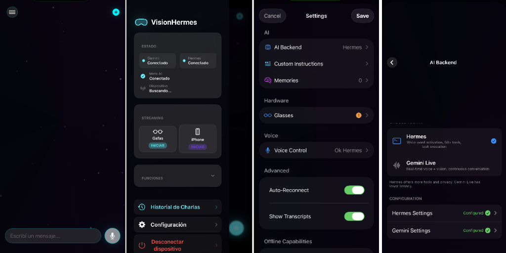

# VisionHermes



A real-time AI assistant for **Meta Ray-Ban smart glasses** and **iPhone**, adapted from VisionClaw to work with **Hermes Agent**. See what you see, hear what you say, and take actions on your behalf -- all through voice.

Attribution:
- Based on [`Intent-Lab/VisionClaw`](https://github.com/Intent-Lab/VisionClaw)
- Some UI parts were adapted from [`rayl15/OpenVision`](https://github.com/rayl15/OpenVision)



Built on [Meta Wearables DAT SDK](https://github.com/facebook/meta-wearables-dat-ios) (iOS) / [DAT Android SDK](https://github.com/facebook/meta-wearables-dat-android) (Android) + [Gemini Live API](https://ai.google.dev/gemini-api/docs/live) + [Hermes Agent](https://hermes-agent.nousresearch.com) (tool execution).

**Supported platforms:** iOS (iPhone) and Android (Pixel, Samsung, etc.)

---

## 🌟 NEW: Gemini + Hermes Tool Ecosystem (v2.0)

VisionHermes now has **6 specialized tools** that connect Gemini's real-time voice+vision intelligence to Hermes Agent's execution power and your Obsidian vault:

| Tool | What it does | Gemini contributes | Hermes executes |
|------|-------------|-------------------|-----------------|
| `execute` | General-purpose actions | Understands the request | Web search, messages, reminders, etc. |
| `gemelo_guardar_respuesta` | **Avatar Personal** — builds an evolving profile of your personality | Asks deep questions, detects emotions and speech patterns | Saves structured responses + analysis to Obsidian |
| `guardar_nota_rapida` | Voice-to-vault notes | Takes dictation, adds context | Creates markdown files in your vault's 📥 Inbox |
| `buscar_en_vault` | Semantic search of your knowledge | Interprets natural language queries | Searches Obsidian vault and returns relevant excerpts |
| `guardar_observacion` | Visual memory from camera | Describes what it sees through the glasses camera | Saves timestamped observations with visual descriptions to vault |
| `exportar_chat_md` | Full conversation export | Summarizes the chat when asked | Exports as markdown + optionally saves to Obsidian |

This turns Gemini from a pure voice assistant into a **bridge between your physical world and your digital brain**.

---

## 🌐 Remote Access (Cloudflare Tunnel)

VisionHermes connects to Hermes Agent through a **Cloudflare Tunnel** for secure access from anywhere:

```
https://your-hermes-domain.example.com → Hermes Agent (localhost:18789)
```

No open ports, no VPN needed. The tunnel handles SSL termination and routing automatically.

To set up your own tunnel:
1. Install [cloudflared](https://developers.cloudflare.com/cloudflare-one/connections/connect-networks/downloads/)
2. Authenticate: `cloudflared tunnel login`
3. Create tunnel: `cloudflared tunnel create <name>`
4. Configure DNS: `cloudflared tunnel route dns <name> your-domain.com`
5. Run: `cloudflared tunnel run <name>`

---

## What It Does

Put on your glasses, tap the AI button, and talk:

- **"What am I looking at?"** -- Gemini sees through your glasses camera and describes the scene
- **"Add milk to my shopping list"** -- delegates to Hermes Agent via `execute`
- **"Send a message to John saying I'll be late"** -- routes through Hermes Agent
- **"Search for the best coffee shops nearby"** -- web search via `execute`, results spoken back
- **NEW: "Let's do today's deep question"** -- starts an Avatar Personal session, Gemini asks profound questions about your life and values, saves to Obsidian
- **NEW: "Save this idea for later"** -- `guardar_nota_rapida` instantly creates a note in your vault
- **NEW: "What do I know about TouchDesigner noise?"** -- `buscar_en_vault` searches your entire Obsidian vault and Gemini reads the answer aloud
- **NEW: "Remember this place"** -- `guardar_observacion` captures what Gemini sees through the camera and saves it as a visual note
- **NEW: "Export this whole conversation"** -- `exportar_chat_md` saves the full transcript as markdown and optionally sends it to your vault

The glasses camera streams at ~1fps to Gemini for visual context, while audio flows bidirectionally in real-time.

---

## 🧬 Avatar Personal Project

One of the flagship features: **building an evolving profile of the user's personality**.

Every day, a deep personal question is sent via Telegram (or asked directly by Gemini). The user responds naturally for 15-20 minutes. Gemini detects emotions, speech patterns, values, and recurring themes. The structured analysis is saved to Obsidian via `gemelo_guardar_respuesta`.

**10 categories, 57 questions total:**

| Category | Questions | Focus |
|----------|-----------|-------|
| 🧠 Philosophy of Life | 7 | Purpose, meaning, worldview |
| 📖 Foundational Memories | 6 | Formative moments |
| 🤝 Relationships | 6 | Connection with others |
| 🎨 Creativity & Process | 6 | Artistic drive |
| 😨 Fear & Vulnerability | 6 | What holds you back |
| 🚀 Dreams & Aspirations | 5 | Future self |
| 🆔 Identity | 6 | Who you really are |
| 🤖 Technology & Humanity | 5 | Relationship with tech |
| ⚖️ Ethics & Boundaries | 5 | Moral lines |
| ☠️ Death & Transcendence | 5 | Legacy |

After each session, the profile accumulates: detected traits, fundamental values, linguistic patterns, and emotional tendencies. The goal: an Avatar Personal that reflects how the user talks, feels, and reacts.

---

## 📜 Chat History & Markdown Export

Every conversation with Gemini is automatically saved to local chat history. You can:

- **Browse past sessions** — tap the Chat History button
- **Export as Markdown** — swipe left on any session and tap "Export as MD" to share or save
- **Send to Vault** — swipe left and tap "To Vault" to send the full transcript to your Obsidian vault via Hermes
- **Export from detail view** — tap the share button in the top right of any session to export or send to vault

Exported conversations land in `📜 Historial Chat/` in your Obsidian vault.

---

## How It Works

```
Meta Ray-Ban Glasses (or phone camera)
       |
       | video frames + mic audio
       v
iOS / Android App (VisionHermes)
       |
       | JPEG frames (~1fps) + PCM audio (16kHz)
       v
Gemini Live API (WebSocket)
       |
       |── Audio response (PCM 24kHz) ──> App ──> Speaker
       |── Tool calls ──> App ──> Hermes Gateway (your-hermes-domain.example.com)
       |                                   |
       |                                   v
       |                         ┌──────────────────────┐
       |                         │   Tool Dispatcher    │
       |                         │                      │
       |                         │  execute             │
       |                         │    → web search, msgs│
       |                         │    → reminders, lists│
       |                         │                      │
       |                         │  gemelo_guardar_resp. │
       |                         │    → 🧬 Avatar Personal│
       |                         │    → perfil acumulativo
       |                         │                      │
       |                         │  guardar_nota_rapida  │
       |                         │    → 📥 Inbox/nota.md│
       |                         │                      │
       |                         │  buscar_en_vault      │
       |                         │    → 🔍 Obsidian search
       |                         │                      │
       |                         │  guardar_observacion  │
       |                         │    → 📸 Observaciones │
       |                         │                      │
       |                         │  exportar_chat_md     │
       |                         │    → 📜 Historial Chat│
       |                         └──────────────────────┘
       |                                   |
       |<── Tool response (text) <── App <──+
       |
       v
  Gemini speaks the result
```

**Key pieces:**
- **Gemini Live** -- real-time voice + vision AI over WebSocket (native audio, not STT-first)
- **Hermes Agent** -- local/cloud gateway that gives Gemini access to 50+ tools, your Obsidian vault, and all your connected apps
- **6 specialized tools** -- each designed for a specific capability (rather than a single catch-all `execute`)
- **Chat History Manager** -- persists all conversations with markdown export + vault sync
- **Phone mode** -- test the full pipeline using your phone camera instead of glasses
- **WebRTC streaming** -- share your glasses POV live to a browser viewer

---

## Quick Start (iOS)

### 1. Clone and open

```bash
git clone https://github.com/tolchx/Vision-Hermes-Agent.git
cd Vision-Hermes-Agent/samples/CameraAccess
open CameraAccess.xcodeproj
```

### 2. Add your secrets

```bash
cp CameraAccess/Secrets.swift.example CameraAccess/Secrets.swift
```

Edit `Secrets.swift` with your [Gemini API key](https://aistudio.google.com/apikey) (required) and your Hermes Agent gateway URL.

**Default values (Cloudflare tunnel):**
- `hermesHost = "https://your-hermes-domain.example.com"`
- `hermesPort = 443`

### 3. Build & Run

Select your iPhone as the target device and hit Run (Cmd+R).

### 4. Build IPA (GitHub Actions)

This repo includes a GitHub Actions workflow that builds an unsigned IPA for sideloading:

1. Push to `main` → build triggers automatically
2. Download the artifact from **Actions → Build iOS App → CameraAccess-Sideloadly**
3. Sideload with [Sideloadly](https://sideloadly.io) or AltStore

### 4. Try it out

**Without glasses (iPhone mode):**
1. Tap **"Start on iPhone"** -- uses your iPhone's back camera
2. Tap the **AI button** to start a Gemini Live session
3. Talk to the AI -- it can see through your iPhone camera

**With Meta Ray-Ban glasses:**

First, enable Developer Mode in the Meta AI app:

1. Open the **Meta AI** app on your iPhone
2. Go to **Settings** (gear icon, bottom left)
3. Tap **App Info**
4. Tap the **App version** number **5 times** -- this unlocks Developer Mode
5. Go back to Settings -- you'll now see a **Developer Mode** toggle. Turn it on.



Then in VisionHermes:
1. Tap **"Start Streaming"** in the app
2. Tap the **AI button** for voice + vision conversation

---

## Quick Start (Android)

### 1. Clone and open

```bash
git clone https://github.com/sseanliu/VisionHermes.git
```

Open `samples/CameraAccessAndroid/` in Android Studio.

### 2. Configure GitHub Packages (DAT SDK)

The Meta DAT Android SDK is distributed via GitHub Packages. You need a GitHub Personal Access Token with `read:packages` scope.

1. Go to [GitHub > Settings > Developer Settings > Personal Access Tokens](https://github.com/settings/tokens) and create a token with `read:packages` scope
2. In `samples/CameraAccessAndroid/local.properties`, add:

```properties
gpr.user=YOUR_GITHUB_USERNAME
gpr.token=YOUR_GITHUB_TOKEN
```

> **Tip:** If you have the `gh` CLI installed, you can run `gh auth token` to get a valid token. Make sure it has `read:packages` scope -- if not, run `gh auth refresh -s read:packages`.

### 3. Add your secrets

```bash
cd samples/CameraAccessAndroid/app/src/main/java/com/meta/wearable/dat/externalsampleapps/cameraaccess/
cp Secrets.kt.example Secrets.kt
```

Edit `Secrets.kt` with your [Gemini API key](https://aistudio.google.com/apikey) (required) and optional Hermes Agent/WebRTC config.

### 4. Build and run

1. Let Gradle sync in Android Studio (it will download the DAT SDK from GitHub Packages)
2. Select your Android phone as the target device
3. Click Run (Shift+F10)

> **Wireless debugging:** You can also install via ADB wirelessly. Enable **Wireless debugging** in your phone's Developer Options, then pair with `adb pair <ip>:<port>`.

### 5. Try it out

**Without glasses (Phone mode):**
1. Tap **"Start on Phone"** -- uses your phone's back camera
2. Tap the **AI button** (sparkle icon) to start a Gemini Live session
3. Talk to the AI -- it can see through your phone camera

**With Meta Ray-Ban glasses:**

Enable Developer Mode in the Meta AI app (same steps as iOS above), then:
1. Tap **"Start Streaming"** in the app
2. Tap the **AI button** for voice + vision conversation

---

## Setup: Hermes Agent (Optional)

Hermes Agent gives Gemini the ability to take real-world actions and access your Obsidian vault. Without it, Gemini is voice + vision only.

### 1. Install and configure Hermes Agent

Follow the [Hermes Agent setup guide](https://github.com/nichochar/openclaw). Make sure the gateway is enabled:

In `~/.hermes/config.yaml`:

```yaml
gateway:
  port: 18789
  bind: "lan"
  auth:
    mode: token
    token: "your-gateway-token-here"
  http:
    endpoints:
      chatCompletions: { enabled: true }
```

Key settings:
- `bind: "lan"` -- exposes the gateway on your local network so your phone can reach it
- `chatCompletions.enabled: true` -- enables the `/v1/chat/completions` endpoint (off by default)
- `auth.token` -- the token your app will use to authenticate

### 2. Configure the app

**iOS** -- In `Secrets.swift`:
```swift
static let hermesHost = "https://your-hermes-domain.example.com"
static let hermesPort = 443
static let hermesGatewayToken = "your-gateway-token-here"
```

**Android** -- In `Secrets.kt`:
```kotlin
const val hermesHost = "https://your-hermes-domain.example.com"
const val hermesPort = 443
const val hermesGatewayToken = "your-gateway-token-here"
```

> Both iOS and Android also have an in-app Settings screen where you can change these values at runtime without editing source code.

### 3. Start the gateway

```bash
hermes gateway restart
```

Verify it's running:

```bash
curl http://localhost:18789/health
```

Now when you talk to the AI, it can execute tasks through Hermes Agent.

---

## Architecture

### Key Files (iOS)

All source code is in `samples/CameraAccess/CameraAccess/`:

| File | Purpose |
|------|---------|
| `Gemini/GeminiConfig.swift` | API keys, model config, system prompt (includes Avatar Personal + tool instructions) |
| `Gemini/GeminiLiveService.swift` | WebSocket client for Gemini Live API |
| `Gemini/AudioManager.swift` | Mic capture (PCM 16kHz) + audio playback (PCM 24kHz) |
| `Gemini/ChatModels.swift` | ChatSession, ChatMessage, Role data models |
| `Gemini/ChatHistoryManager.swift` | Persists chat sessions, exports to Markdown, vault sync |
| `Gemini/GeminiSessionViewModel.swift` | Session lifecycle, tool call wiring, transcript state, history manager integration |
| `Hermes/ToolCallModels.swift` | **6 tool declarations** (execute, gemelo_guardar_respuesta, guardar_nota_rapida, buscar_en_vault, guardar_observacion, exportar_chat_md) |
| `Hermes/HermesBridge.swift` | HTTP client for Hermes Agent gateway (chat completions endpoint) |
| `Hermes/ToolCallRouter.swift` | Routes Gemini tool calls to correct handler, export sharing |
| `Views/ChatHistoryView.swift` | Chat history UI with MD export + vault sync for each session |
| `iPhone/IPhoneCameraManager.swift` | AVCaptureSession wrapper for iPhone camera mode |
| `WebRTC/WebRTCClient.swift` | WebRTC peer connection + SDP negotiation |
| `WebRTC/SignalingClient.swift` | WebSocket signaling for WebRTC rooms |

### Key Files (Android)

*Note: Android tool declarations need to be updated to match iOS v2.0 tools*

All source code is in `samples/CameraAccessAndroid/app/src/main/java/.../cameraaccess/`:

| File | Purpose |
|------|---------|
| `gemini/GeminiConfig.kt` | API keys, model config, system prompt |
| `gemini/GeminiLiveService.kt` | OkHttp WebSocket client for Gemini Live API |
| `gemini/AudioManager.kt` | AudioRecord (16kHz) + AudioTrack (24kHz) |
| `gemini/GeminiSessionViewModel.kt` | Session lifecycle, tool call wiring, UI state |
| `openclaw/ToolCallModels.kt` | Tool declarations, data classes |
| `openclaw/HermesBridge.kt` | OkHttp HTTP client for Hermes Agent gateway |
| `openclaw/ToolCallRouter.kt` | Routes Gemini tool calls to Hermes Agent |
| `phone/PhoneCameraManager.kt` | CameraX wrapper for phone camera mode |
| `webrtc/WebRTCClient.kt` | WebRTC peer connection (stream-webrtc-android) |
| `webrtc/SignalingClient.kt` | OkHttp WebSocket signaling for WebRTC rooms |
| `settings/SettingsManager.kt` | SharedPreferences with Secrets.kt fallback |

### Audio Pipeline

- **Input**: Phone mic -> AudioManager (PCM Int16, 16kHz mono, 100ms chunks) -> Gemini WebSocket
- **Output**: Gemini WebSocket -> AudioManager playback queue -> Phone speaker
- **iOS iPhone mode**: Uses `.voiceChat` audio session for echo cancellation + mic gating during AI speech
- **iOS Glasses mode**: Uses `.videoChat` audio session (mic is on glasses, speaker is on phone -- no echo)
- **Android**: Uses `VOICE_COMMUNICATION` audio source for built-in acoustic echo cancellation

### Video Pipeline

- **Glasses**: DAT SDK video stream (24fps) -> throttle to ~1fps -> JPEG (50% quality) -> Gemini
- **Phone**: Camera capture (30fps) -> throttle to ~1fps -> JPEG -> Gemini

### Tool Calling

VisionHermes now supports **6 specialized tool declarations** (previously just 1). Each tool has its own data schema and routing logic:

1. **`execute(task)`** — General-purpose. Web search, messages, reminders, smart home, etc. Be detailed in the task description.

2. **`gemelo_guardar_respuesta(categoria, pregunta, respuesta, analisis_emocion?, frases_clave?, nuevo_rasgo?)`** — Saves Avatar Personal responses. Captures category, question, answer, emotional analysis, key quotes, and new personality traits.

3. **`guardar_nota_rapida(titulo, contenido, carpeta?)`** — Voice-to-vault. Creates markdown notes in the specified folder (default: 📥 Inbox).

4. **`buscar_en_vault(consulta, limite?)`** — Semantic search of your Obsidian vault. Gemini interprets the natural language query, Hermes searches the vault and returns relevant excerpts.

5. **`guardar_observacion(titulo, descripcion, contexto?, tags?)`** — Visual memory. Gemini describes what it sees through the camera, saves as a timestamped observation in the vault.

6. **`exportar_chat_md(titulo, guardar_en_vault?)`** — Conversation export. Generates a full markdown transcript locally (shares via activity sheet) and optionally sends to Obsidian.

**Flow:**
1. User speaks a request
2. Gemini acknowledges verbally (e.g. "Saving that idea now")
3. Gemini sends `toolCall` with the appropriate function name and parameters
4. `ToolCallRouter` parses the function name and routes to the correct handler
5. Handler builds a structured task string (with `[PREFIX]`) and sends to Hermes gateway
6. Hermes recognizes the prefix and executes the correct action (file write, search, export)
7. Result returns to Gemini via `toolResponse`
8. Gemini speaks the confirmation

---

## Requirements

### iOS
- iOS 17.0+
- Xcode 15.0+
- Gemini API key ([get one free](https://aistudio.google.com/apikey))
- Meta Ray-Ban glasses (optional -- use iPhone mode for testing)
- Hermes Agent running locally or via Cloudflare Tunnel (optional -- for agentic actions)

### Android
- Android 14+ (API 34+)
- Android Studio Ladybug or newer
- GitHub account with `read:packages` token (for DAT SDK)
- Gemini API key ([get one free](https://aistudio.google.com/apikey))
- Meta Ray-Ban glasses (optional -- use Phone mode for testing)
- Hermes Agent running locally or via Cloudflare Tunnel (optional -- for agentic actions)

---

## Troubleshooting

### General

**Gemini doesn't hear me** -- Check that microphone permission is granted. The app uses aggressive voice activity detection -- speak clearly and at normal volume.

**Hermes connection timeout** -- Make sure your iPhone can reach the gateway. Test by opening `https://your-hermes-domain.example.com/v1/models` in Safari — should return JSON. If it works in Safari but not the app, check Settings → Debug → App Log for the exact error.

**Duplicate browser tabs** — This is a known upstream issue in Hermes Agent's CDP connection management.

### iOS-specific

**"Gemini API key not configured"** -- Add your API key in Secrets.swift or in the in-app Settings.

**Echo/feedback in iPhone mode** -- The app mutes the mic while the AI is speaking. If you still hear echo, try turning down the volume.

### Android-specific

**Gradle sync fails with 401 Unauthorized** -- Your GitHub token is missing or doesn't have `read:packages` scope. Check `local.properties` for `gpr.user` and `gpr.token`. Generate a new token at [github.com/settings/tokens](https://github.com/settings/tokens).

**Gemini WebSocket times out** -- The Gemini Live API sends binary WebSocket frames. If you're building a custom client, make sure to handle both text and binary frame types.

**Audio not working** -- Ensure `RECORD_AUDIO` permission is granted. On Android 13+, you may need to grant this permission manually in Settings > Apps.

**Phone camera not starting** -- Ensure `CAMERA` permission is granted. CameraX requires both the permission and a valid lifecycle.

For DAT SDK issues, see the [developer documentation](https://wearables.developer.meta.com/docs/develop/) or the [discussions forum](https://github.com/facebook/meta-wearables-dat-ios/discussions).

---

## 🐛 Debug Features

### App Log
Settings → **Debug → App Log** shows real-time logs from the app: connection attempts, errors, URL construction, and tool call results.

### Test Connection
Settings → **AI Backend → Hermes Settings → Test Connection** lets you manually test the Hermes gateway and see the exact error.

---

## 🔇 Background Audio (Lock Screen)

VisionHermes supports **background audio playback**, so you can keep talking to the AI even with the screen locked — perfect for using with Bluetooth headphones while the phone is in your pocket.

**How it works:**
- The app registers as an audio app with the system (like Music or Podcasts)
- Audio continues streaming through Gemini Live even when the screen is off
- Bluetooth headphones (HFP/A2DP) work seamlessly
- The app shows in the **Now Playing** control center and lock screen

**Requirements:**
- iOS 17.0+
- Bluetooth headphones (AirPods, etc.) recommended for best experience
- Active Gemini Live session

**No configuration needed** — it works automatically after installing the latest IPA.

---

## 📦 Pre-built IPA (iOS)

The latest unsigned IPA is built via GitHub Actions on every push to `main`.

1. Go to **Actions → Build iOS App**
2. Download **CameraAccess-Sideloadly** artifact
3. Install with [Sideloadly](https://sideloadly.io) or AltStore

## 📦 Pre-built APK (Android)

The debug APK is built via GitHub Actions on every push to `main`.

1. Go to **Actions → Build Android APK**
2. Download **CameraAccess-Android-Debug** artifact
3. Install directly or via `adb install`

---

## License

This source code is licensed under the license found in the [LICENSE](LICENSE) file in the root directory of this source tree.
